# Vagrant con VirtualBox
## 3. Proyecto Celtics
### 3.3 Comprobar
Vamos a crear una MV nueva y la vamos a iniciar usando Vagrant:

  * Debemos estar dentro de vagrant5-celtics.

  * vagrant up, para iniciar una nueva instancia de la máquina.

  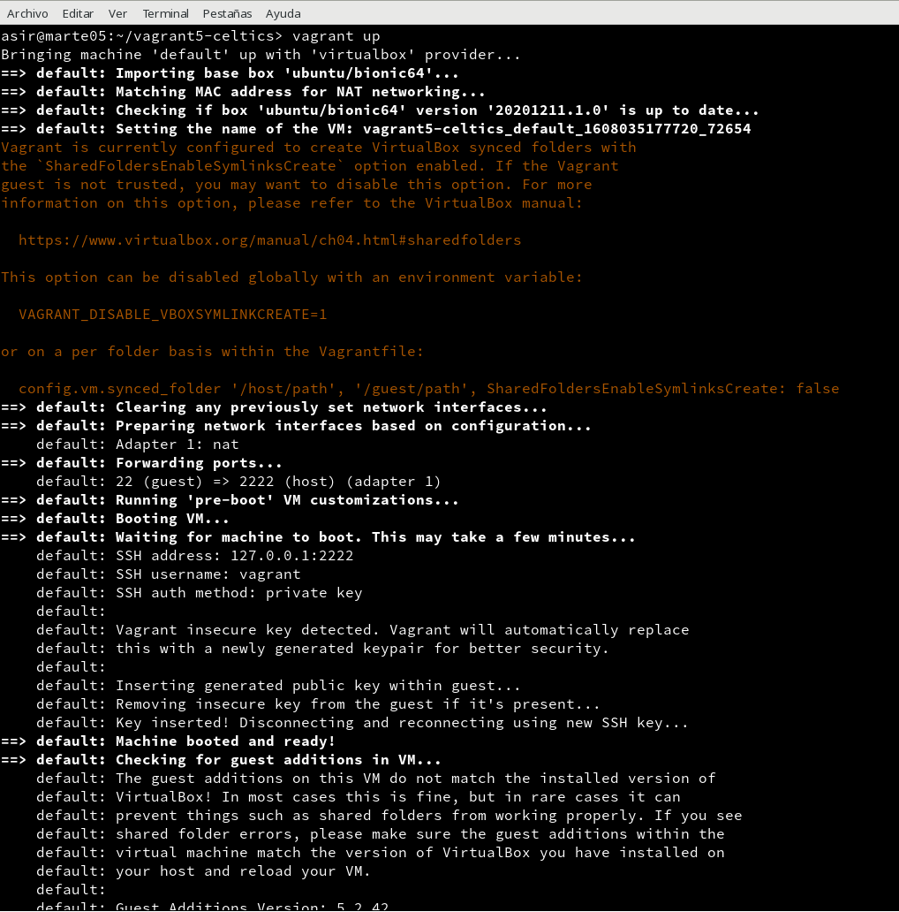

* vagrant ssh: Conectar/entrar en nuestra máquina virtual usando SSH.

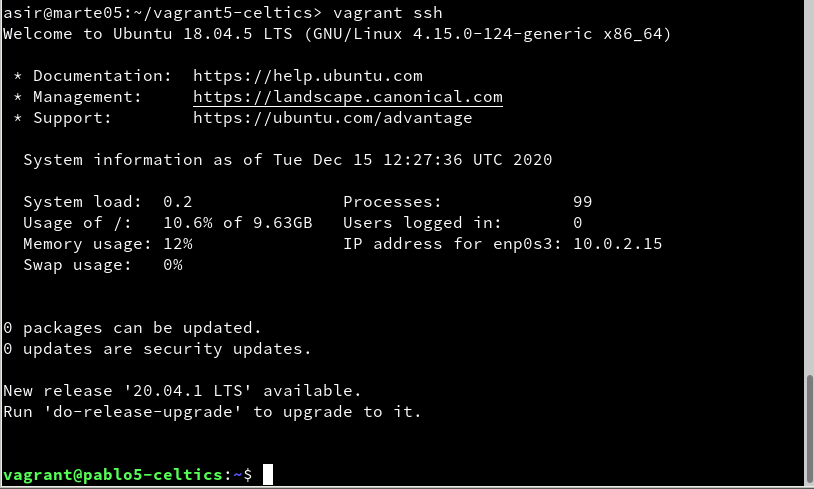
## 5. Proyecto Hawks
### 5.2 Comprobar
Para confirmar que hay un servicio a la escucha en 4567, desde la máquina real podemos ejecutar los siguientes comandos:

* En el HOST-CON-VAGRANT (Máquina real). Comprobaremos que el puerto 4567 está a la escucha. vagrant port para ver la redirección de puertos de la máquina Vagrant.

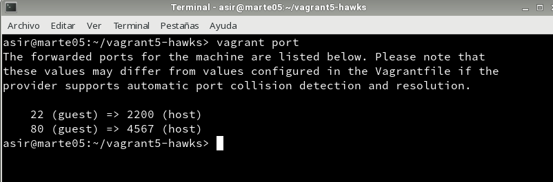
* En HOST-CON-VAGRANT, abrimos el navegador web con el URL http://127.0.0.1:4567. En realidad estamos accediendo al puerto 80 de nuestro sistema virtualizado.

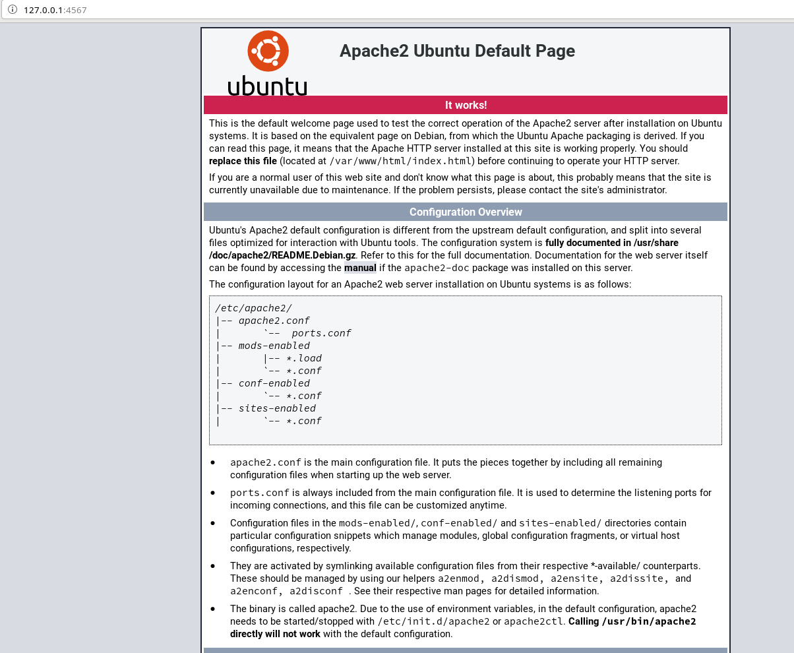
## 6. Suministro
### 6.1 Proyecto Lakers (Suministro mediante shell script)
Ahora vamos a suministrar a la MV un pequeño script para instalar Apache.
* Crear directorio vagrant5-lakers para nuestro proyecto.

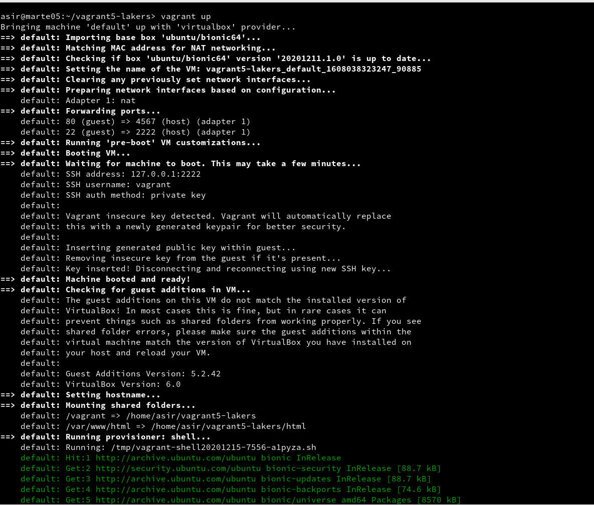
* Entrar en dicha carpeta.

* Crear la carpeta html y crear fichero html/index.html con el siguiente contenido:

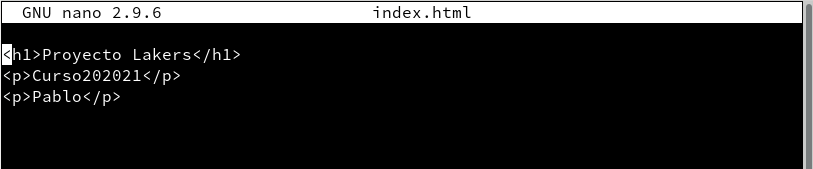

Crear el script install_apache.sh, dentro del proyecto con el siguiente contenido:

* apt-get update
* apt-get install -y apache2

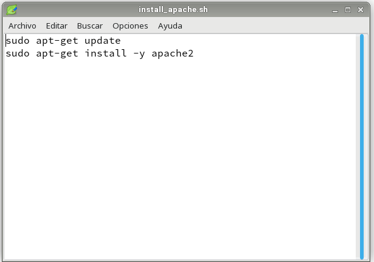

Incluir en el fichero de configuración Vagrantfile lo siguiente:

* config.vm.hostname = "nombre-alumnoXX-lakers"

* config.vm.provision :shell, :path => "install_apache.sh", para indicar a Vagrant que debe ejecutar el script install_apache.sh dentro del entorno virtual.

* config.vm.synced_folder "html", "/var/www/html", para sincronizar la carpeta exterior html con la carpeta interior. De esta forma el fichero "index.html" será visible dentro de la MV.

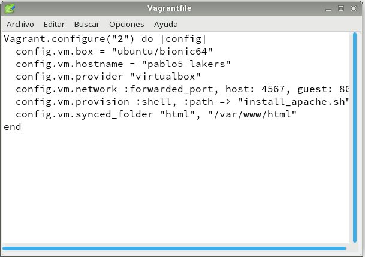
* vagrant up, para crear la MV.

Podremos notar, al iniciar la máquina, que en los mensajes de salida se muestran mensajes que indican cómo se va instalando el paquete de Apache que indicamos.
* Para verificar que efectivamente el servidor Apache ha sido instalado e iniciado, abrimos navegador en la máquina real con URL http://127.0.0.1:4567.

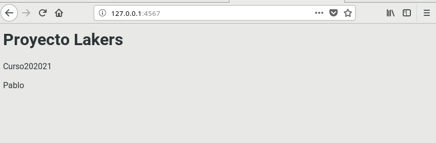

### 6.2 Proyecto Raptors (Suministro mediante Puppet)

* Crear directorio vagrantXX-raptors como nuevo proyecto Vagrant.

* Modificar el archivo Vagrantfile de la siguiente forma:

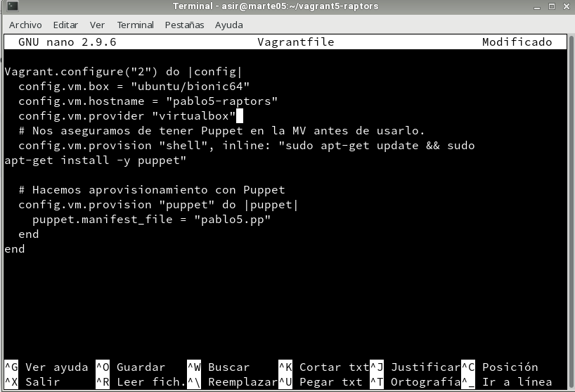

* Crear la carpeta manifests. OJO: un error muy típico es olvidarnos de la "s" final.

* Crear el fichero manifests/nombre-del-alumnoXX.pp, con las órdenes/instrucciones Puppet necesarias para instalar el software que elijamos (Cambiar PACKAGENAME por el paquete que queramos). Ejemplo:

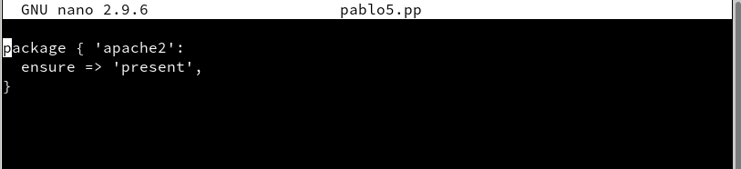

Con la MV encendida
* vagrant reload, recargar la configuración.

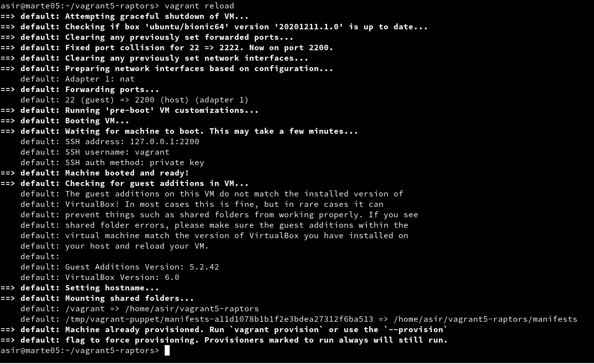

* vagrant provision, volver a ejecutar la provisión.

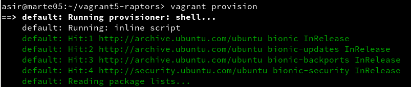
Con la MV apagada:
  * vagrant destroy, destruir la MV.

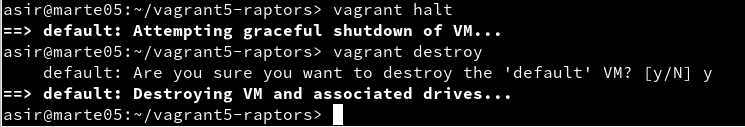
  * vagrant up volver a crearla.

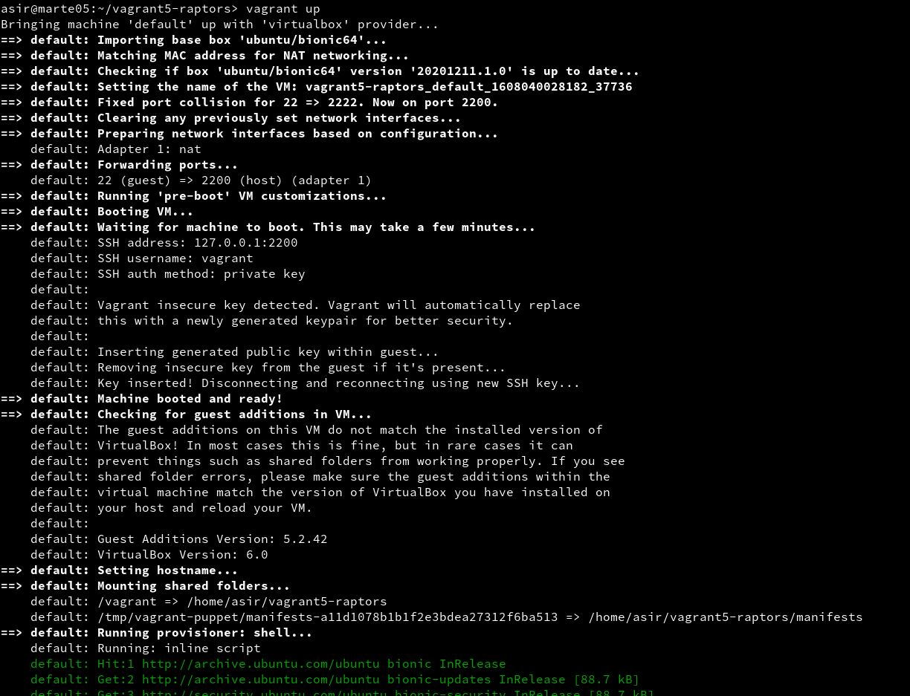
