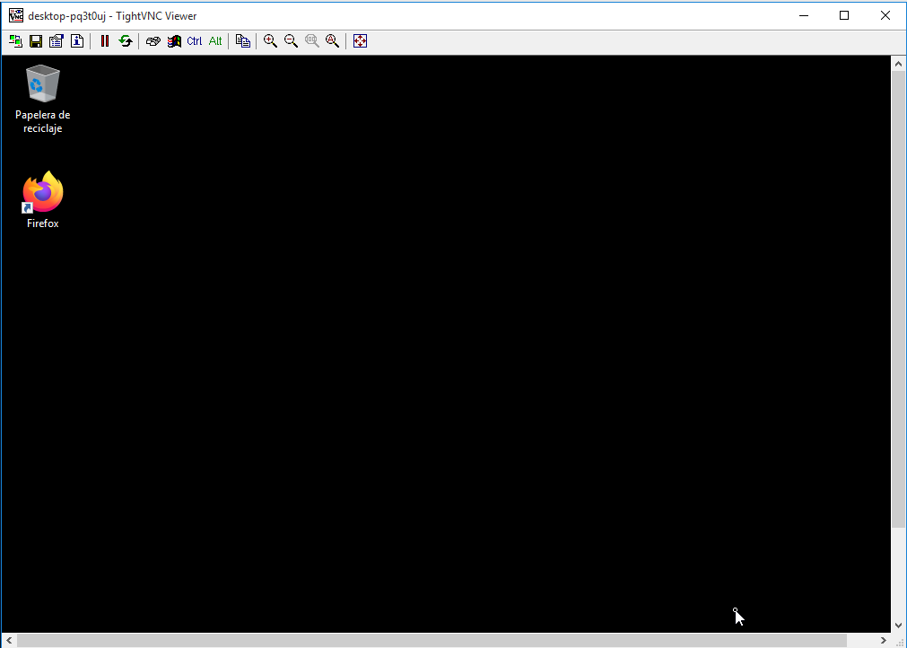

**P1: ACCESO REMOTO VNC**

**1. Windows: Slave VNC**

  Configurar las máquinas virtuales para que tengan lo siguiente:

Windows 	172.AA.XX.11 	Slave VNC 	Instalar servidor VNC

  

Windows 	172.AA.XX.12 	Master VNC 	Instalar cliente VNC

    Descargar TightVNC.

  

    Esta es una herramienta libre disponible para Windows.

  

    En el servidor VNC instalaremos
    TightVNC -> Custom -> Server.

    Revisar la configuración del cortafuegos del servidor VNC
    Windows para permitir VNC.

**1.2. Ir a una máquina con GNU/Linux**

    Ejecutar "nmap -Pn IP-VNC-SERVER", desde la máquina real
    GNU/Linux para comprobar que los servicios son visibles
    desde fuera de la máquina VNC-SERVER. Deben verse los
    puertos 580X, 590X, etc.

  **2. Windows: Master VNC**

    En el cliente Windows instalar
    TightVNC -> Custom -> Viewer.
    Usaremos TightVNC Viewer. Esto es el cliente VNC.

**2.1. Comprobaciones finales**

Para verificar que se han establecido las conexiones remotas:

    Conectar desde Window Master hacia el Windows Slave.

  

  

    Ir al servidor VNC y usar el comando "netstat -n"
    para ver las conexiones VNC con el cliente.

