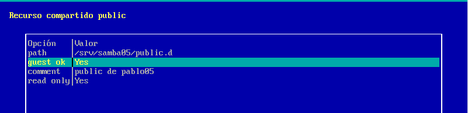
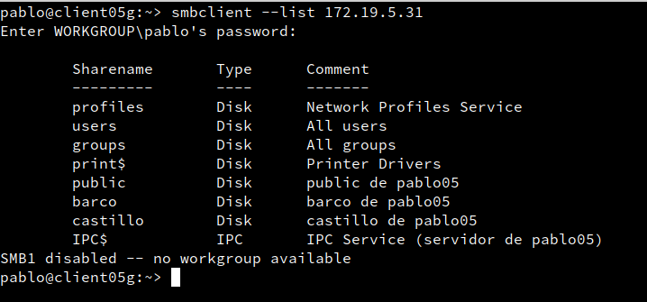
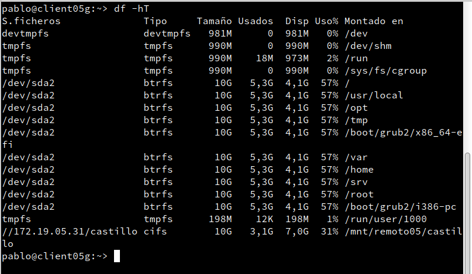

# P1: Recursos SMB/CIFS
## 1. Servidor Samba (MV1)
Vamos a GNU/Linux, y creamos los siguientes grupos y usuarios locales:

* Crear los grupos piratas, soldados y sambausers.

* Crear el usuario sambaguest. Para asegurarnos que nadie puede usar sambaguest para entrar en nuestra máquina mediante login, vamos a modificar este usuario y le ponemos como shell /bin/false. NOTA: Podemos hacer estos cambios por entorno gráfico usando Yast, o por comandos editando el fichero /etc/passwd.

* Dentro del grupo piratas incluir a los usuarios pirata1, pirata2 y supersamba.

* Dentro del grupo soldados incluir a los usuarios soldado1 y soldado2 y supersamba.

* Dentro del grupo sambausers, poner a todos los usuarios soldados, piratas, supersamba y a sambaguest.

Creamos la carpeta base para los recursos de red de Samba de la siguiente forma:

        "mkdir /srv/samba05"
        "chmod 755 /srv/samba05"
  Vamos a crear las carpetas para los recursos compartidos de la siguiente forma:

Recurso 	Directorio 	Usuario 	Grupo 	Permisos:

* Public 	  
  * /srv/sambaXX/public.d
  * supersamba
  * sambausers 	
  * 770
* Castillo 	
  * /srv/sambaXX/castillo.d 	
  * supersamba 	
  * soldados 	
  * 770
* Barco 	
  * /srv/sambaXX/barco.d 	
  * supersamba 	
  * piratas 	
  * 770

Para instalar y configurar el servicio Samba, podemos usar comandos o el entorno gráfico. Como estamos en OpenSUSE vamos a usar Yast.
**"cp /etc/samba/smb.conf /etc/samba/smb.conf.bak"**, hacer una copia de seguridad del fichero de configuración antes de modificarlo.
    
Yast -> Samba Server
    

* Workgroup: curso2021
* Sin controlador de dominio.

En la pestaña de Inicio definimos
        Iniciar el servicio durante el arranque de la máquina.
        Ajustes del cortafuegos -> Abrir puertos

Comprobar CORTAFUEGOS

Para descartar un problema del servidor Samba con el cortafuegos, usaremos el comando nmap -Pn IP-servidor-Samba desde otra máquina GNU/Linux. Los puertos SMB/CIFS (139 y 445) deben estar abiertos.

Vamos a configurar los recursos compartidos de red en el servidor. Podemos hacerlo modificando el fichero de configuración o por entorno gráfico con Yast.

Tenemos que conseguir una configuración con las secciones: global, public, barco, y castillo como la siguiente:
* public, será un recurso compartido accesible para todos los usuarios en modo lectura.

* barco, recurso compartido de red de lectura/escritura para todos los piratas.

* castillo, recurso compartido de red de lectura/escritura para todos los soldados.

Podemos modificar la configuración:
        (a) Editando directamente el fichero /etc/samba/smb.conf
        (b) Yast -> Samba Server -> Recursos compartidos -> Configurar.

**"testparm"**, verificar la sintaxis del fichero de configuración.

**"more /etc/samba/smb.conf"**, consultar el contenido del fichero de configuración.

Después de crear los usuarios en el sistema, hay que añadirlos a Samba.

**"smbpasswd -a USUARIO"**, para crear clave Samba de USUARIO.
USUARIO son los usuarios que se conectarán a los recursos compartidos SMB/CIFS.Esto hay que hacerlo para cada uno de los usuarios de Samba.

**"pdbedit -L"**, para comprobar la lista de usuarios Samba.  

Demonios Samba y servicios relacionados

* Ahora que hemos terminado con el servidor, hay que recargar los ficheros de configuración del servicio. Esto es, leer los cambios de configuración. Podemos hacerlo por Yast -> Servicios, o usar los comandos: systemctl restart smb y systemctl restart nmb.
* **"sudo lsof -i"**, comprobar que el servicio SMB/CIF está a la escucha.

## 2. Windows
Desde un cliente Windows vamos a acceder a los recursos compartidos del servidor Samba.

Escribimos "\\ip-del-servidor-samba y vemos lo siguiente:

Acceder al recurso compartido con el usuario invitado
* net use para ver las conexiones abiertas.
* net use * /d /y, para borrar todas las conexión SMB/CIFS que se hadn realizado.

Acceder al recurso compartido con el usuario soldado
* net use para ver las conexiones abiertas.
* net use * /d /y, para borrar todas las conexión SMB/CIFS que se han realizado.

Acceder al recurso compartido con el usuario pirata
* Ir al servidor Samba.
* Capturar imagen de los siguientes comandos para comprobar los resultados:
  * **"smbstatus"**, desde el servidor Samba.

  * **"lsof -i"**, desde el servidor Samba.

Abrir una shell de windows.
* **"net use"**, para consultar todas las conexiones/recursos conectados hacemos. Con net use /?, podemos consultar la ayuda.
Si hubiera alguna conexión abierta la cerramos.
* **"net use * /d /y"**, para cerrar las conexiones SMB.
* **"net use"** ahora vemos que NO hay conexiones establecidas.

Capturar imagen de los comandos siguientes:

  * net view \\IP-SERVIDOR-SAMBA, para ver los recursos de esta máquina.

Montar el recurso barco de forma persistente.
* **"net use S: \\IP-SERVIDOR-SAMBA\recurso contraseña /USER:usuario /p:yes"** crear una conexión con el recurso compartido y lo monta en la unidad S. Con la opción /p:yes hacemos el montaje persistente. De modo que se mantiene en cada reinicio de máquina.

* net use, comprobamos.

Ahora podemos entrar en la unidad S ("s:") y crear carpetas, etc.

Capturar imagen de los siguientes comandos para comprobar los resultados:
  * **"smbstatus"**, desde el servidor Samba.

  * **"lsof -i"**, desde el servidor Samba.

  
  ## 3 Cliente GNU/Linux
  Desde en entorno gráfico, podemos comprobar el acceso a recursos compartidos SMB/CIFS.

Ejemplo accediendo al recurso prueba del servidor Samba, pulsamos CTRL+L y escribimos **"smb://IP-SERVIDOR-SAMBA"**:

En el momento de autenticarse para acceder al recurso remoto, poner en Dominio el nombre-netbios-del-servidor-samba.

Capturar imagen de lo siguiente:

* Probar a crear carpetas/archivos en castillo y en barco.

* Comprobar que el recurso public es de sólo lectura.

* Capturar imagen de los siguientes comandos para comprobar los resultados:
  * smbstatus, desde el servidor Samba.

  * lsof -i, desde el servidor Samba.

Capturar imagenes de todo el proceso.

Existen comandos (smbclient, mount , smbmount, etc.) para ayudarnos a acceder vía comandos al servidor Samba desde el cliente. Puede ser que con las nuevas actualizaciones y cambios de las distribuciones alguno haya cambiado de nombre.

Vamos a un equipo GNU/Linux que será nuestro cliente Samba. Desde este equipo usaremos comandos para acceder a la carpeta compartida.

Probar desde una máquina Ubuntu **"sudo smbtree"** (REVISAR: no muestra nada). Esto muestra todos los equipos/recursos de la red SMB/CIFS.

* Hay que parar el cortafuegos para que funcione **(systemctl stop firewalld)**, o bien ejecutar comando desde la máquina real.

Probar desde OpenSUSE: **"smbclient --list IP-SERVIDOR-SAMBA"**, Muestra los recursos SMB/CIFS de un equipo.

* Ahora crearemos en local la carpeta **"/mnt/remotoXX/castillo"**.
* Con el usuario root, usamos el siguiente comando para montar un recurso compartido de Samba Server, como si fuera una carpeta más de nuestro sistema: **mount -t cifs //172.AA.XX.31/castillo /mnt/remotoXX/castillo -o username=soldado1"**

En versiones anteriores de GNU/Linux se usaba el comando

**"smbmount //smb-serverXX/public /mnt/remotoXX/public/ -o -username=smbguest."**

* **"df -hT"**, para comprobar que el recurso ha sido montado.

Si montamos la carpeta de castillo, lo que escribamos en /mnt/remotoXX/castillo debe aparecer en la máquina del servidor Samba.

Para desmontar el recurso remoto usamos el comando "umount".

Capturar imagen de los siguientes comandos para comprobar los resultados:
* **"smbstatus"**, desde el servidor Samba.

* **lsof -i**, desde el servidor Samba.

Hacer una instantánea de la MV antes de seguir. Por seguridad.

Capturar imágenes del proceso.

Reiniciar la MV.

**"df -hT"**. Los recursos ya NO están montados. El montaje anterior fue temporal.

Antes accedimos a los recursos remotos, realizando un montaje de forma manual (comandos mount/umount). Si reiniciamos el equipo cliente, podremos ver que los montajes realizados de forma manual ya no están. Si queremos volver a acceder a los recursos remotos debemos repetir el proceso de montaje manual, a no ser que hagamos una configuración de montaje permanente o automática.

Para configurar acciones de montaje automáticos cada vez que se inicie el equipo, debemos configurar el fichero /etc/fstab. Veamos un ejemplo:

* **"//smb-serverXX/public /mnt/remotoXX/public cifs username=soldado1,password=clave 0 0"**

* Reiniciar el equipo y comprobar que se realiza el montaje automático al inicio.

* Incluir contenido del fichero **"/etc/fstab"** en la entrega.

