# **P2: Acceso remoto con SSH**
## **1. Preparativos**
Para comenzar con la práctica necesitaremos lo siguiente:
* Un servidor SSH - GNU/Linux OpenSUSE (Sin entorno gráfico) - 192.168.0.31 - server05g
* Un cliente SSH - GNU/Linux OpenSUSE - 192.168.0.32 - client05g
* Un servidor SSH 	Windows Server 	192.168.0.11 	server05s
* Un cliente SSH 	Windows 	192.168.0.12 	cliente05w

Configurar el servidor GNU/Linux con siguientes valores:
* SO GNU/Linux: OpenSUSE - Sin entorno gráfico.
* Nombre de equipo: server05g
* Poner clave compleja al usuario root.
* Añadir en **"/etc/hosts"** los equipos client05g y client05w.

Crear los siguientes usuarios en server05g:

  * rodriguez1
  * rodriguez2
  * rodriguez3
  * rodriguez4

Instalaremos el software cliente SSH en Windows. Para este ejemplo usaremos PuTTY.
Configurarwmos el cliente2 Windows con los siguientes valores:
  * SO Windows
  * Nombre de equipo: clientXXw
  * Configuración de las MV's
  * Añadir en **"C:\Windows\System32\drivers\etc\hosts"** los equipos server05g y client05g.

 Para realizar esto deberemos ir a la carpeta **"C:\Windows\System32\drivers\etc"**, cuando estemos aquí ejecutamos el siguiente comando:

    "notepad hosts"

  Al realizar esto se nos abrirá el bloc de notas en donde podemos poner las ips.

## 2. Instalación del servicio SSH
Instalaremos el servicio SSH en la máquina serverXXg. Por comandos o entorno gráfico.

  * Desde la herramienta yast -> Instalar Software
  * Desde terminal **"zypper search openssh"** muestra los paquetes instalados o no con nombre openssh*.
  * Desde terminal **"zypper install openssh"**, instala el paquete OpenSSH.Desde el propio servidor, verificar que el servicio está en ejecución.

  **"systemctl status sshd"**, esta es la forma habitual de comprobar los servicios.

  **"ps -ef|grep sshd"**, esta es otra forma de comprobarlo mirando los procesos del sistema.

  **"sudo lsof -i:22"**, comprobar que el servicio está escuchando por el puerto 22.

  Ir al cliente client05g.
* ping server05g, comprobar la conectividad con el servidor.
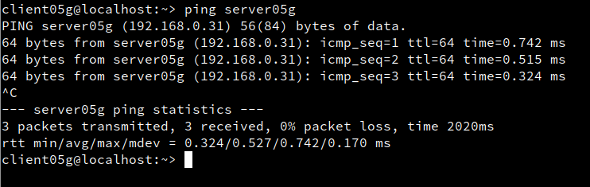

* nmap -Pn server05g, comprobar los puertos abiertos en el servidor (SSH debe estar open). Debe mostrarnos que el puerto 22 está abierto. Debe aparecer una línea como "22/tcp open ssh". Si esto falla, debemos comprobar en el servidor la configuración del cortafuegos.
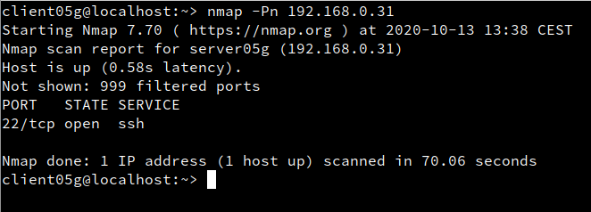

Desde el cliente GNU/Linux nos conectamos mediante **"ssh rodriguez1@192.168.0.31"**.
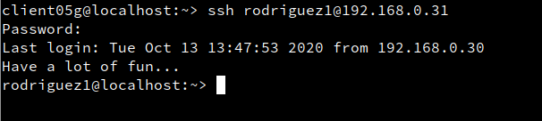

Comprobar contenido del fichero **"$HOME/.ssh/known_hosts"** en el equipo cliente.
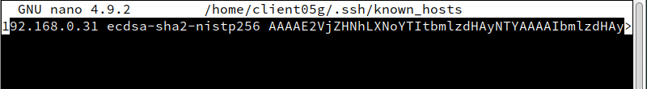

Desde el cliente Windows nos conectamos usando PuTTY.

Podremos ver el intercambio de claves que se produce en el primer proceso de conexión SSH.
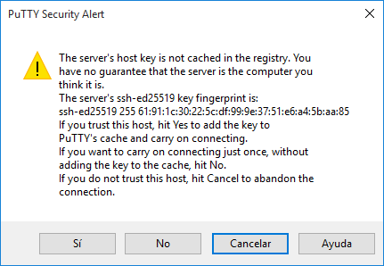
Guardar la identificación del servidor.

La siguiente vez que volvamos a usar PuTTY ya no debe aparecer el mensaje de advertencia porque hemos memorizado la identificación del servidor SSH.

## 3. Cambiamos la identidad del servidor
Los ficheros ssh_host*key y ssh_host*key.pub, son ficheros de clave pública/privada que identifican a nuestro servidor frente a nuestros clientes. Confirmar que existen en /etc/ssh.

Modificar el fichero de configuración SSH (/etc/ssh/sshd_config) para dejar una única línea: HostKey /etc/ssh/ssh_host_rsa_key. Comentar el resto de líneas con configuración HostKey. Este parámetro define los ficheros de clave publica/privada que van a identificar a nuestro servidor. Con este cambio decimos que sólo se van a utilizar las claves del tipo RSA.
Vamos a cambiar o volver a generar nuevas claves públicas/privadas que identifican nuestro servidor.

Ir al servidor.
* Como usuario root ejecutamos: **"ssh-keygen -t rsa -f /etc/ssh/ssh_host_rsa_key"**. ¡OJO! No poner password al certificado.

* Reiniciar el servicio SSH: **"systemctl restart sshd"**.

* Comprobar que el servicio está en ejecución correctamente: **"systemctl status sshd"**.

Comprobar qué sucede al volver a conectarnos desde el cliente, usando el usuario rodriguez2.
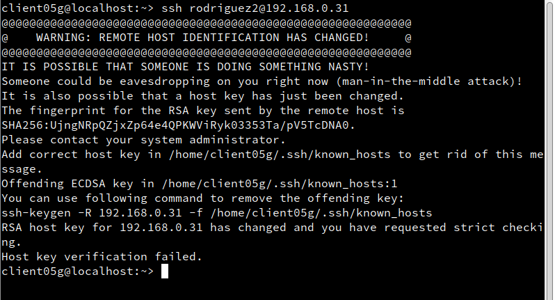

Para solucionarlo... lee los mensajes de advertencia. ¡Ahí está todo lo que necesitas!
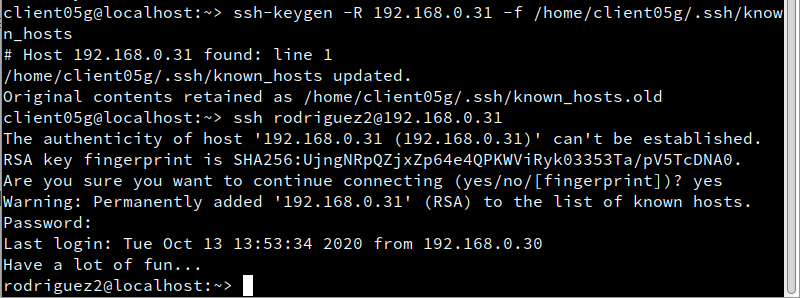

## 4. Personalización del prompt Bash
Podemos añadir las siguientes líneas al fichero de configuración del 1er-apellido-alumno1 en la máquina servidor (Fichero **"/home/1er-apellido-alumno1/.bashrc"**)

    # Se cambia el prompt al conectarse vía SSH
    if [ -n "$SSH_CLIENT" ];
    then PS1="AccesoRemoto_\e[32m\u@\h:\e[0m \w\a\$ "
    else
    PS1="\[$(pwd)\]\u@\h:\w>"
    fi
Además, crear el fichero el fichero /home/1er-apellido-alumno1/.alias, donde pondremos el siguiente contenido:

    alias c='clear'
    alias g='geany'
    alias p='ping'
    alias v='vdir -cFl'
    alias s='ssh'
## 5. Autenticación mediante claves públicas
Vamos a la máquina clientXXg.

¡OJO! No usar el usuario root.

Iniciamos sesión con nuestro el usuario nombre-alumno (en mi caso me he equivocado y sería cliente05g) de la máquina client05g .

ssh-keygen -t rsa para generar un nuevo par de claves para el usuario en:
* /home/nombre-alumno/.ssh/id_rsa
* /home/nombre-alumno/.ssh/id_rsa.pub

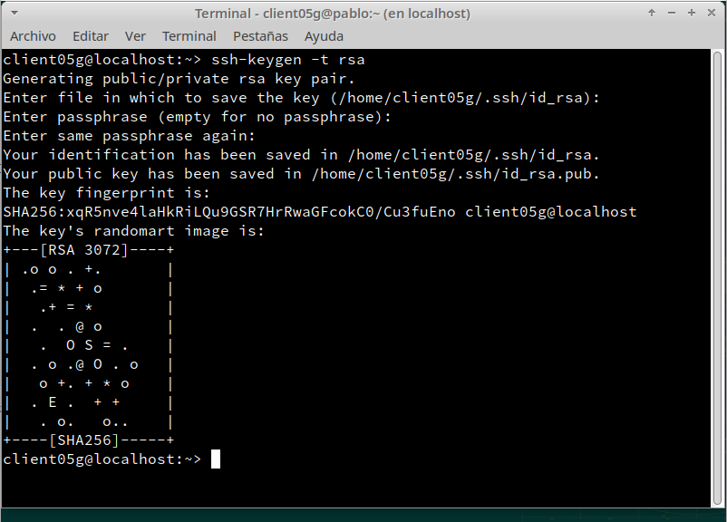

Ahora vamos a copiar la clave pública (id_rsa.pub), al fichero "authorized_keys" del usuario remoto rodriguez4 que está definido en el servidor.

Hay varias formas de hacerlo.

El modo recomendado es usando el comando ssh-copy-id. Ejemplo para copiar la clave pública del usuario actual al usuario remoto en la máquina remota: "ssh-copy-id rodriguez4@192.168.0.31".
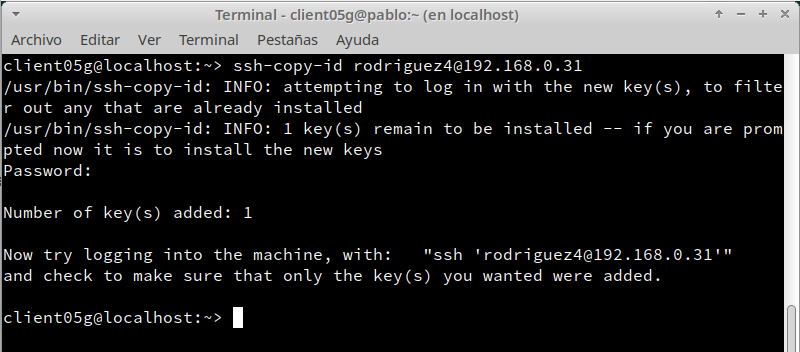

Comprobar que ahora al acceder remotamente vía SSH

* Desde client05g, NO se pide password.

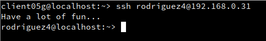
* Desde client05w, SI se pide el password.

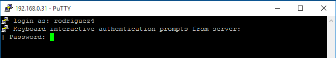
## 6. Uso de SSH como túnel para X
Instalar en el servidor una aplicación de entorno gráfico (Geany) que no esté en los clientes. Por ejemplo Geany. Si estuviera en el cliente entonces buscar otra aplicación o desinstalarla en el cliente.

Modificar servidor SSH para permitir la ejecución de aplicaciones gráficas, desde los clientes. Consultar fichero de configuración /etc/ssh/sshd_config (Opción X11Forwarding yes)

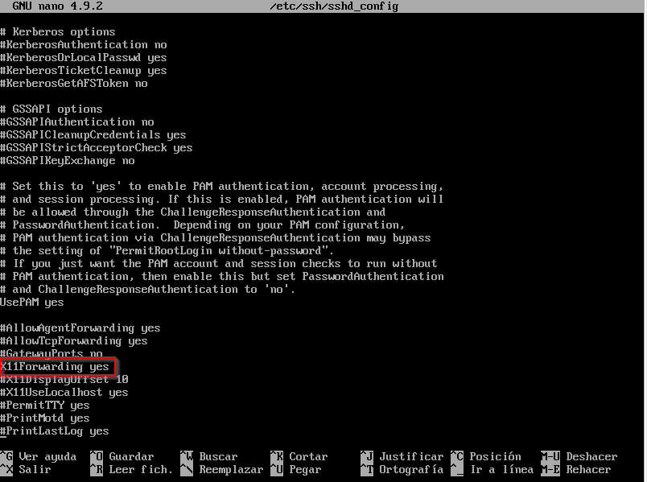
Reiniciar el servicio SSH para que se lean los cambios de configuración.

Vamos a client05g.

"zypper se geany",comprobar que no está instalado el programa.

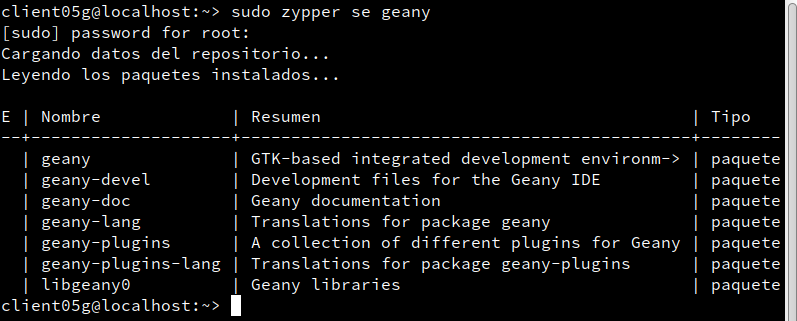
Vamos a comprobar desde client05g, que funciona geany(del servidor).

"ssh -X rodriguez1@192.168.0.31", nos conectamos de forma remota al servidor, y ahora ejecutamos geany de forma remota.
 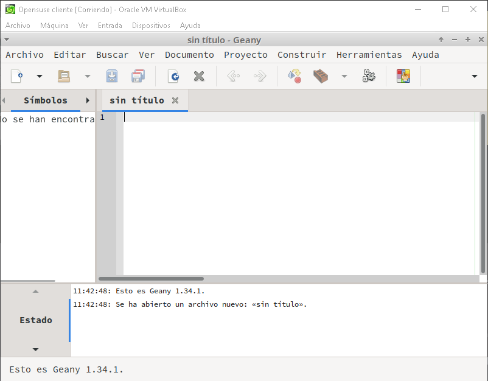

    ¡OJO! El parámetro es -X en mayúsculas, no minúsculas.
## 7. Aplicaciones Windows nativas
Podemos tener aplicaciones Windows nativas instaladas en ssh-server mediante el emulador WINE.

Instalar emulador Wine en el server05g.

Ahora podríamos instalar alguna aplicación (APP2) de Windows en el servidor SSH usando el emulador Wine. O podemos usar el Block de Notas que viene con Wine: wine notepad.

Comprobar el funcionamiento de APP2 en server05g.

Comprobar funcionamiento de APP2, accediendo desde client05g.
## 8. Restricciones de uso
Vamos a crear una restricción de uso del SSH para un usuario:

En el servidor tenemos el usuario rodriguez2. Desde local en el servidor podemos usar sin problemas el usuario.

Vamos a modificar SSH de modo que al usar el usuario por SSH desde los clientes tendremos permiso denegado.

Capturar imagen de los siguientes pasos:

Consultar/modificar fichero de configuración del servidor SSH (/etc/ssh/sshd_config) para restringir el acceso a determinados usuarios. Consultar las opciones AllowUsers, DenyUsers (Más información en: man sshd_config)

"/usr/sbin/sshd -t; echo $?", comprobar si la sintaxis del fichero de configuración del servicio SSH es correcta (Respuesta 0 => OK, 1 => ERROR).

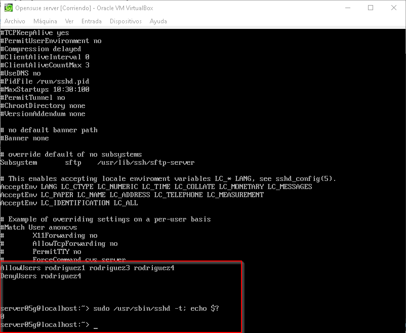

Comprobarlo la restricción al acceder desde los clientes.
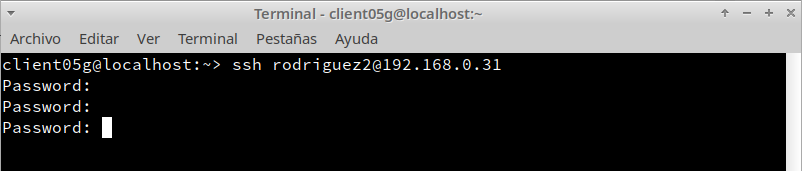

Vamos a crear una restricción de permisos sobre determinadas aplicaciones.

Crear grupo remoteapps

Incluir al usuario 1er-apellido-alumno4 en el grupo remoteapps.

Localizar el programa APP1. Posiblemente tenga permisos 755.

Poner al programa APP1 el grupo propietario a remoteapps.

Poner los permisos del ejecutable de APP1 a 750. Para impedir que los usuarios que no pertenezcan al grupo puedan ejecutar el programa.

Comprobamos el funcionamiento en el servidor en local.

Comprobamos el funcionamiento desde el cliente en remoto (Recordar ssh -X).
## 9. Servidor SSH en Windows
  Configurar el servidor Windows con los siguientes valores:

  * SO Windows Server
  * Nombre de equipo: server05s
  * Añadir en C:\Windows\System32\drivers\etc\hosts el equipo client05g y client05w.

Comprobar haciendo ping a ambos equipos.

Instalar y configurar el servidor SSH en Windows.

Elegir la opción que se quiera: OpenSSH o integrado.

Documentar el proceso de instalación y configuración.

Comprobar acceso SSH desde los clientes Windows y GNU/Linux al servidor SSH Windows.

        "netstat -n" en Windows.
        "lsof -i -n" en GNU/Linux.
