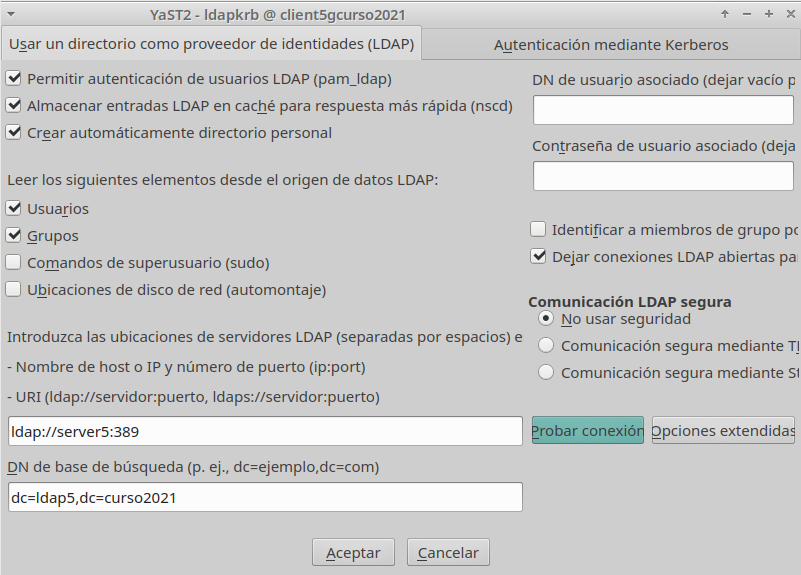
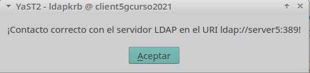
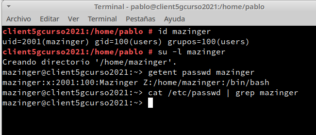

# Cliente para autenticación LDAP
## 1. Preparativos
Comprobamos el acceso al LDAP desde el cliente:
  Ir a MV cliente.

  **"nmap -Pn IP-LDAP-SERVERXX | grep -P '389|636'"**, para comprobar que el servidor LDAP es accesible desde la MV2 cliente.

  

  **"ldapsearch -H ldap://IP-LDAP-SERVERXX:389 -W -D "cn=Directory Manager" -b "dc=ldapXX,dc=curso2021" "(uid=*)" | grep dn"**, comprobamos que los usuarios del LDAP remoto son visibles en el cliente.

## 2. Configurar autenticación LDAP
### 2.1 Crear conexión con servidor
Vamos a configurar de la conexión del cliente con el servidor LDAP.

Ir a la MV cliente.

No aseguramos de tener bien el nombre del equipo y nombre de dominio (/etc/hostname, /etc/hosts)

* Ir a Yast -> Cliente LDAP y Kerberos.
  * BaseDN: dc=ldapXX,dc=curso2021
  * DN de usuario: cn=Directory Manager
  * Contraseña: CLAVE del usuario cn=Directory Manager

  
  * Al final usar la opción de Probar conexión

  
### 2.2 Comprobar con comandos
Vamos a la consola con usuario root, y probamos lo siguiente:
* **"id mazinger"**
* **"su -l mazinger"**    Entramos con el usuario definido en LDAP
* **"getent passwd mazinger"**           Comprobamos los datos del usuario
* **"cat /etc/passwd | grep mazinger"**  El usuario NO es local

