# Contenedores con Docker
## 3. Crear contenedor a partir de nuestra imagen
### 3.2 Comprobamos

Abrimos una nueva terminal.

**"docker ps"**, nos muestra los contenedores en ejecución. Podemos apreciar que la última columna nos indica que el puerto 80 del contenedor está redireccionado a un puerto local 0.0.0.0.:PORT -> 80/tcp.

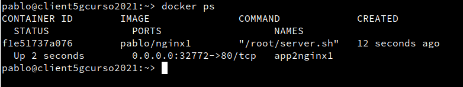

Abrir navegador web y poner URL 0.0.0.0.:PORT. De esta forma nos conectaremos con el servidor Nginx que se está ejecutando dentro del contenedor.

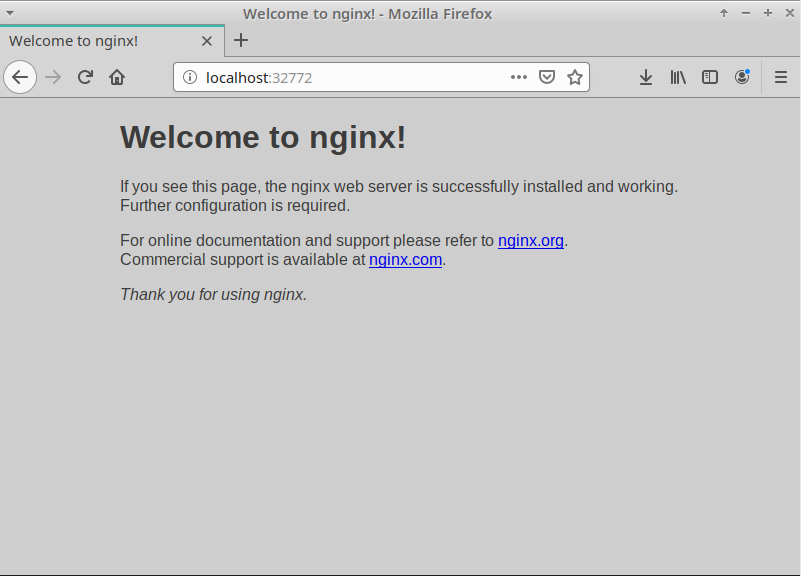

Comprobar el acceso a holamundo1.html.

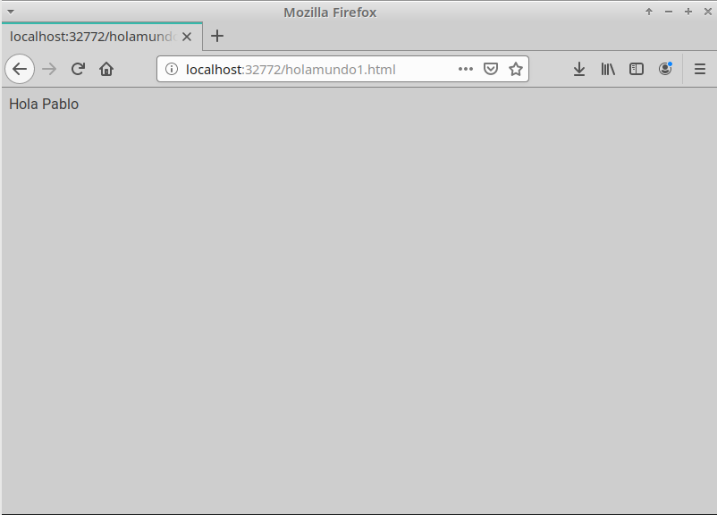

Paramos el contenedor app2nginx1 y lo eliminamos.

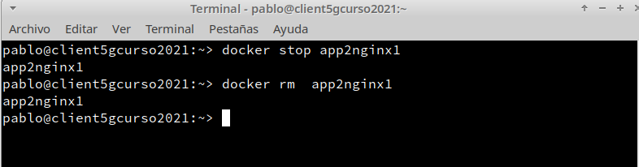

### 3.3 Migrar la imagen a otra máquina

Exportar imagen Docker a fichero tar:

* **"docker save -o alumnoXXdocker.tar nombre-alumno/nginx1"**, guardamos la imagen "nombre-alumno/nginx1" en un fichero tar.

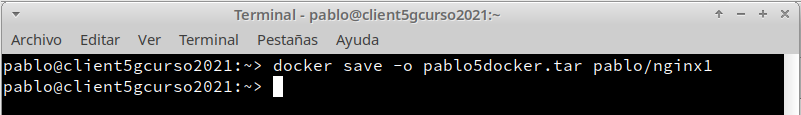

Importar imagen Docker desde fichero:

* Coger la imagen de un compañero de clase.

* Nos llevamos el tar a otra máquina con docker instalado, y restauramos.

* **"docker load -i alumnoXXdocker.tar"**, cargamos la imagen docker a partir del fichero tar. Cuando se importa una imagen se muestra en pantalla las capas que tiene. Las capas las veremos en un momento.

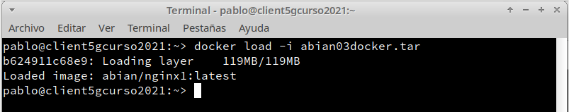

* **"docker images"**, comprobamos que la nueva imagen está disponible.

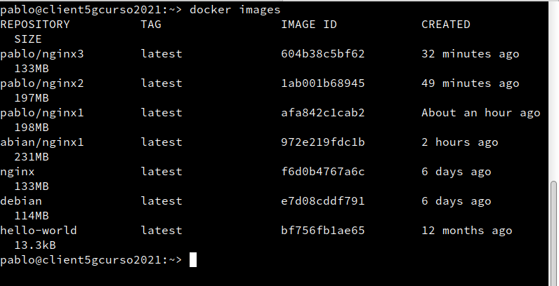

* Probar a crear un contenedor (app3alumno), a partir de la nueva imagen.

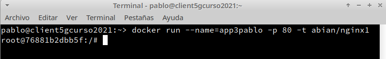

## 4. Dockerfile
### 4.2 Crear imagen a partir del Dockerfile

El fichero Dockerfile contiene toda la información necesaria para construir el contenedor, veamos:

**"cd dockerXXa"**, entramos al directorio con el Dockerfile.

**"docker build -t nombre-alumno/nginx2 ."**, construye una nueva imagen a partir del Dockerfile. OJO: el punto final es necesario.

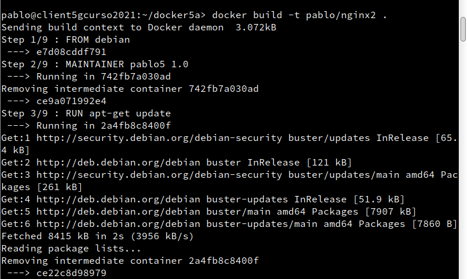

**"docker images"**, ahora debe aparecer nuestra nueva imagen.

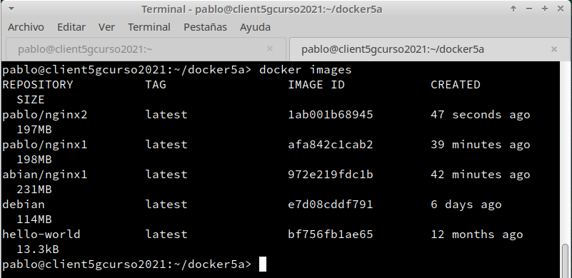

### 4.3 Crear contenedor y comprobar
A continuación vamos a crear un contenedor con el nombre app4nginx2, a partir de la imagen nombre-alumno/nginx2. Probaremos con:

**"docker run --name=app4nginx2 -p 8082:80 -t nombre-alumno/nginx2"**

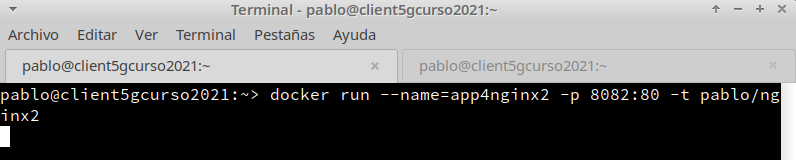

Desde otra terminal:

**"docker ps"**, para comprobar que el contenedor está en ejecución y en escucha por el puerto deseado.

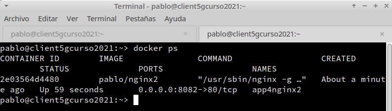

Comprobar en el navegador:
* URL http://localhost:PORTNUMBER

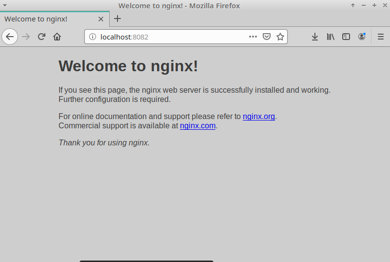

* URL http://localhost:PORTNUMBER/holamundo2.html

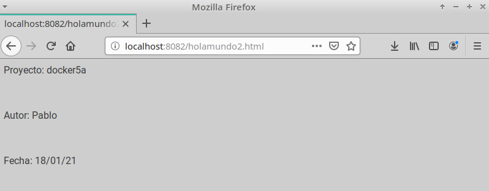

### 4.4 Usar imágenes ya creadas
Crea el directorio dockerXXb. Entrar al directorio.

Crear fichero holamundo3.html con:
* Proyecto: dockerXXb
* Autor: Nombre del alumno
* Fecha: Fecha actual

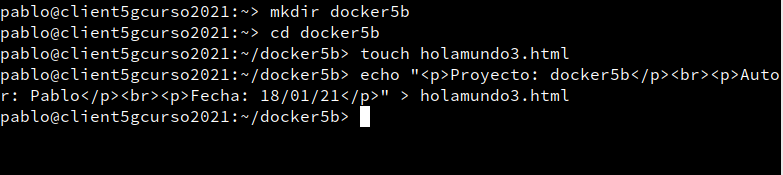

  Crea el siguiente Dockerfile

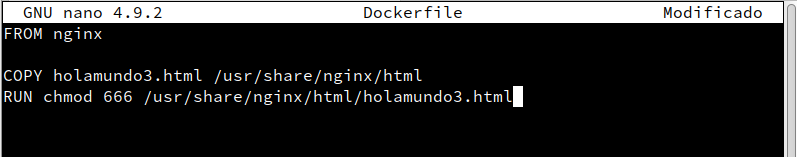

Poner el el directorio dockerXXb los ficheros que se requieran para construir el contenedor.

**"docker build -t nombre-alumno/nginx3 ."**, crear la imagen.

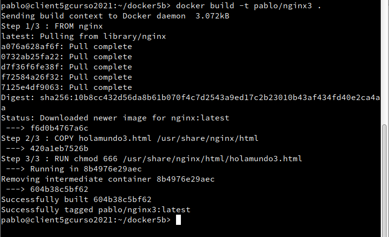

**"docker run --name=app5nginx3 -d -p 8083:80 nombre-alumno/nginx3"**, crear contenedor.

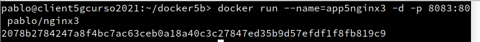

Comprobar el acceso a "holamundo3.html".
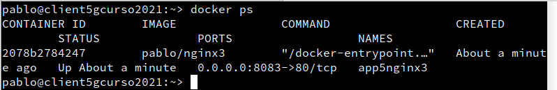

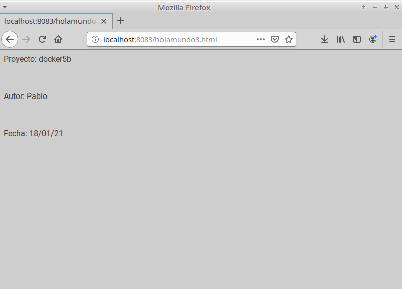

## 5. Docker Hub

Ahora vamos a crear un contenedor "holamundo" y subirlo a Docker Hub.

Crear nuestra imagen "holamundo":

* Crear carpeta dockerXXc. Entrar en la carpeta.
* Crear un script (holamundoXX.sh) con lo siguiente:

 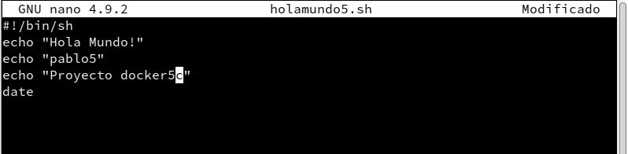

Este script muestra varios mensajes por pantalla al ejecutarse.

Crear fichero Dockerfile:

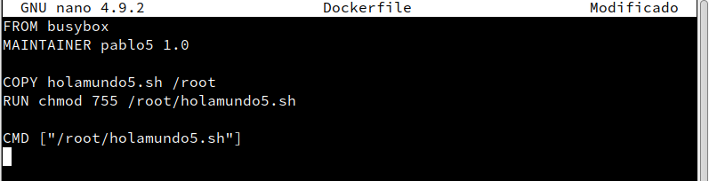

A partir del Dockerfile anterior crearemos la imagen nombre-alumno/holamundo.

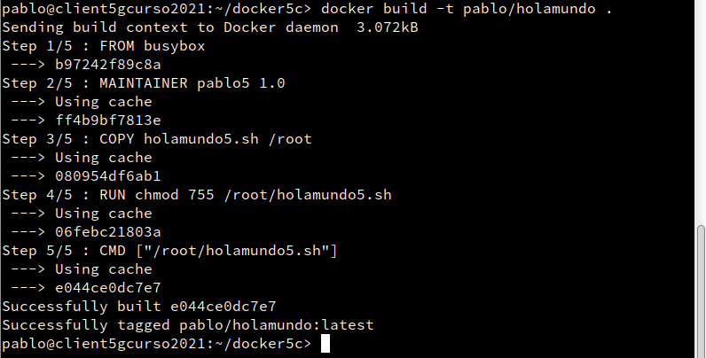

Comprobar que docker run nombre-alumno/holamundo se crea un contenedor que ejecuta el script.

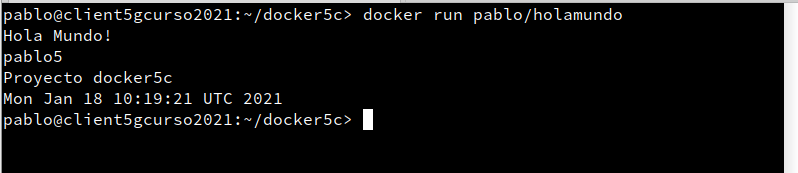

Subir la imagen a Docker Hub:

Registrarse en Docker Hub.

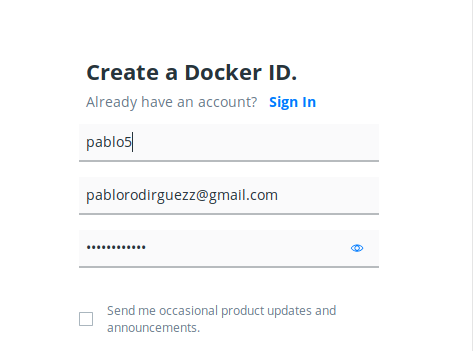

**"docker login -u USUARIO-DOCKER"**, para abrir la conexión.

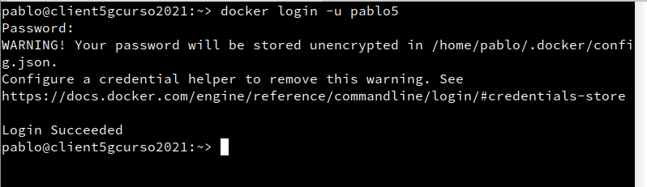

**"docker tag nombre-alumno/holamundo:latest USUARIO-DOCKER/holamundo:version1"**, etiquetamos la imagen con "version1".

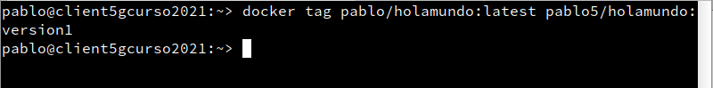

**"docker push USUARIO-DOCKER/holamundo:version1"**, para subir la imagen (version1) a los repositorios de Docker.

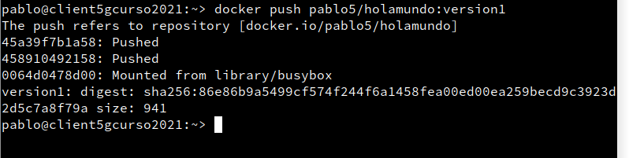

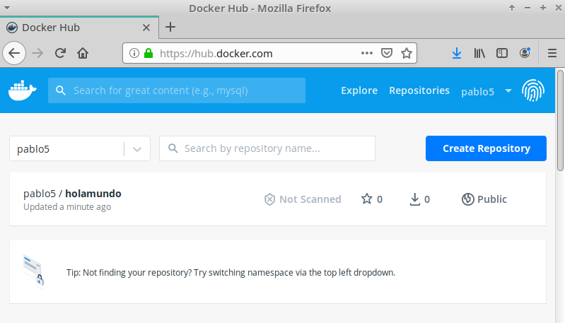
