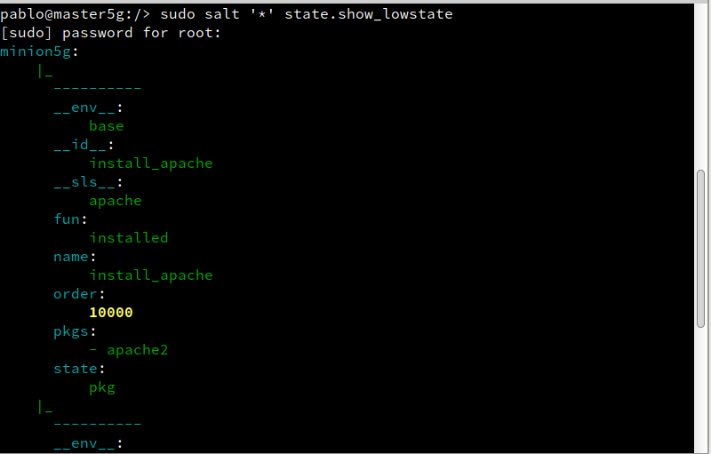

# Salt-stack
## 3. Minion
### 3.4 Comprobamos conectividad
Desde el Máster comprobamos:

Conectividad hacia los Minions.

 **"salt '*' test.ping"**

 
 
Versión de Salt instalada en los Minions

**"salt '*' test.version"**

## 4. Salt States

### 4.5 Aplicar el nuevo estado
Ir al Master:

Consultar los estados en detalle y verificar que no hay errores en las definiciones.

**"salt '*' state.show_lowstate"**

**"salt '*' state.show_highstate"**,

**"salt '*' state.apply apache"**, para aplicar el nuevo estado en todos los minions. OJO: Esta acción puede tardar un tiempo.

## 5. Crear más estados

### 5.1 Crear estado "users"
Vamos a crear un estado llamado users que nos servirá para crear un grupo y usuarios en las máquinas Minions 

Crear directorio /srv/salt/base/users.

Crear fichero /srv/salt/base/users/init.sls con las definiciones para crear los siguiente:

* Grupo mazingerz

 * Usuarios kojiXX, drinfiernoXX dentro de dicho grupo.

 

Aplicar el estado.

### 5.2 Crear estado "dirs"
Gestión de ficheros

Crear estado dirs para crear las carpetas private (700), public (755) y group (750) en el HOME del usuario koji.

Aplicar el estado dirs.

